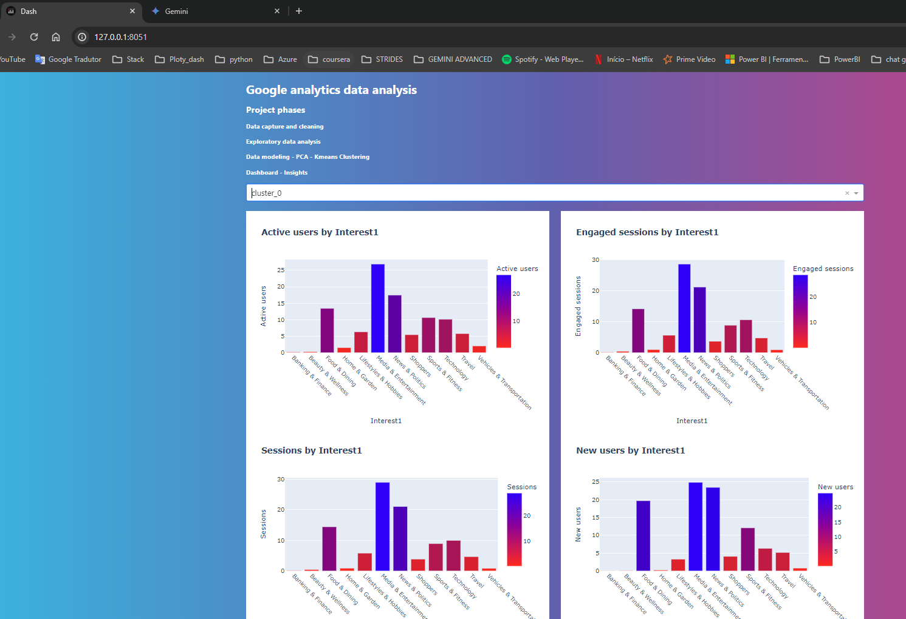
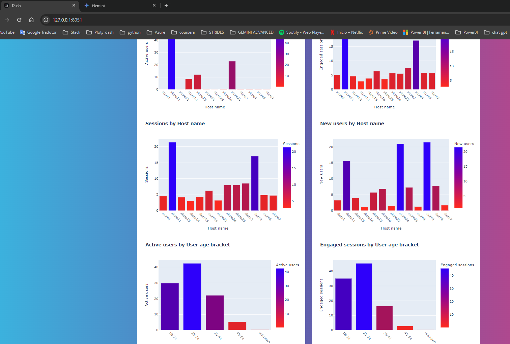

## Projeto de análise de dados do Google Analytcs (GA)

**1- *GA - dados de acesso a sites das lojas**
**2- *Segmentação utilizando PCA e Kmeans para criação de dashboard analítico**
**3- *Dashboard (DASH e Plotly) - resultado dos clusters para posterior análise de time de MKT para criação de "personas" para campanhas"**

Python script's functionality:

**Title: Data Clustering for Marketing Analysis**

**Purpose:**

* Processes raw website browsing and event data
* Cleans and prepares data for analysis.
* Identifies patterns and clusters in user behavior based on event names, browsing interests, host name, and user age bracket.
* Assigns simplified store names for easier readability.

**Steps:**

1. **Data Preparation**
   * Loads CSV data using Pandas (`pd.read_csv`).
   * Removes unnecessary columns.
   * Filters out specified host names.
   * Aggregates related data for specific host.
   * Splits the 'Branding interest' column into multiple interest categories.

2. **Categorical Data Encoding**
   * Identifies columns containing text data.
   * Uses `LabelEncoder` to convert text categories into numerical representations for easier analysis.

3. **Key Creation and Aggregation:**
    * Creates a unique 'key' column based on combinations of 'Event name', 'Interest1', 'Host name', and 'User age bracket'.
    * Groups data by the 'key' and calculates sums for numeric columns.

4. **Dimensionality Reduction (PCA)**
   * Selects numerical columns and fills missing values with the mean.
   * Applies Principal Component Analysis (PCA) to reduce data into two dimensions.

5. **Clustering (KMeans)**
   * Uses KMeans clustering (with 4 clusters) on the PCA-transformed data to find groups of similar user behavior.
   * Assigns cluster labels to the data.

6. **Silhouette Score Calculation**
   * Calculates the Silhouette Score to evaluate the quality of the clustering results.

7. **Result Merging and Filtering**
   * Merges the cluster assignments back into the original dataset.
   * Filters the data to focus on a specific cluster (in this case, cluster 0).

Absolutely! Here's a breakdown of the script, continuing the numbering for clarity:

**8. Data Transformation**

* **`transform_dataframe(df)` function:**
    * **Label Encoding:**
       * Creates a `LabelEncoder` to convert categorical text data in the following columns into numerical values:
         *  'Event name'
         *  'Interest1'
         *  'Host name'
         *  'User age bracket'
       * Adds new columns with the suffix '_encoded' to store the encoded values.
    * **Concatenation:** 
       * Creates a new  'concatenated' column by combining the encoded values and the 'cluster' column (all as strings). This acts as a unique identifier for groupings. 
    * **Label Extraction:**
        * Creates  `df_labels`, a subset containing the original category columns ('Event name', 'Interest1', etc.), the 'cluster', and the 'concatenated' identifier. Duplicates are removed.
    * **Grouping and Aggregation:**
        * Groups data by the 'concatenated' identifier and sums 'Active users', 'Engaged sessions', 'Sessions' and 'New Users'.  
        * Resets the index to make 'concatenated' a regular column.
    * **Merging Labels:**
        * Merges `df_labels` back into the aggregated dataframe (`df_new`), using  'concatenated' as the joining key. This reintroduces the original text-based category labels.

**9. Figure Generation**

* **`create_figures(df, cluster)` function** 
    * **Filtering:** Isolates data for a specific cluster.
    * **Grouping:** Creates multiple groupings based on each column listed in `columns_to_groupby`.
    * **Calculation:** For each grouping:
        * Sums the target metrics ('Active Users', etc.)
        * Normalizes percentage contributions (values in each group sum to 100%) 
    * **Plotting:**  Generates bar plots using Plotly Express for each grouping / metric combination:
        * X-axis: The grouping category
        * Y-axis: The chosen metric's percentage contribution
        * Color: Represents the metric value using a gradient
        * Title: Indicates the metric and grouping clearly 
        * Hover:  Shows percentage values with 2 decimal places.

**10. Saving Figures**

* Uses Python's `pickle` module to serialize and save the `figs` dictionary (containing all generated Plotly figures) into files named 'figs.pkl', etc.  This allows to reload and use these figures later without regenerating them.

**11. App Dashboard**

